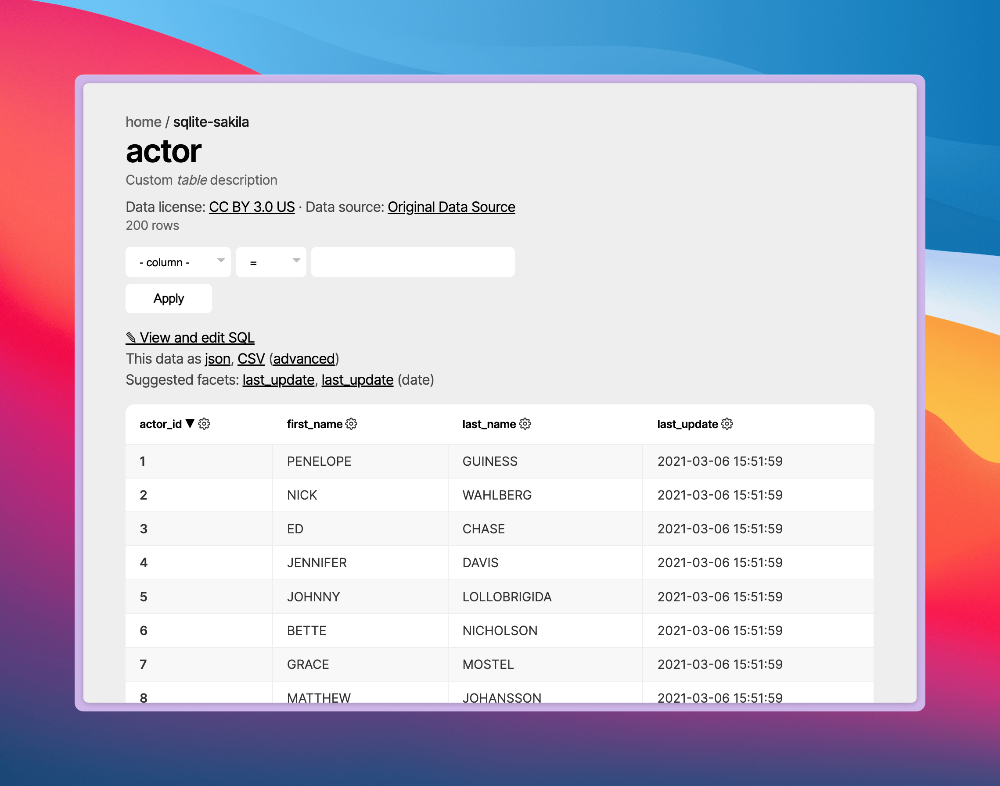
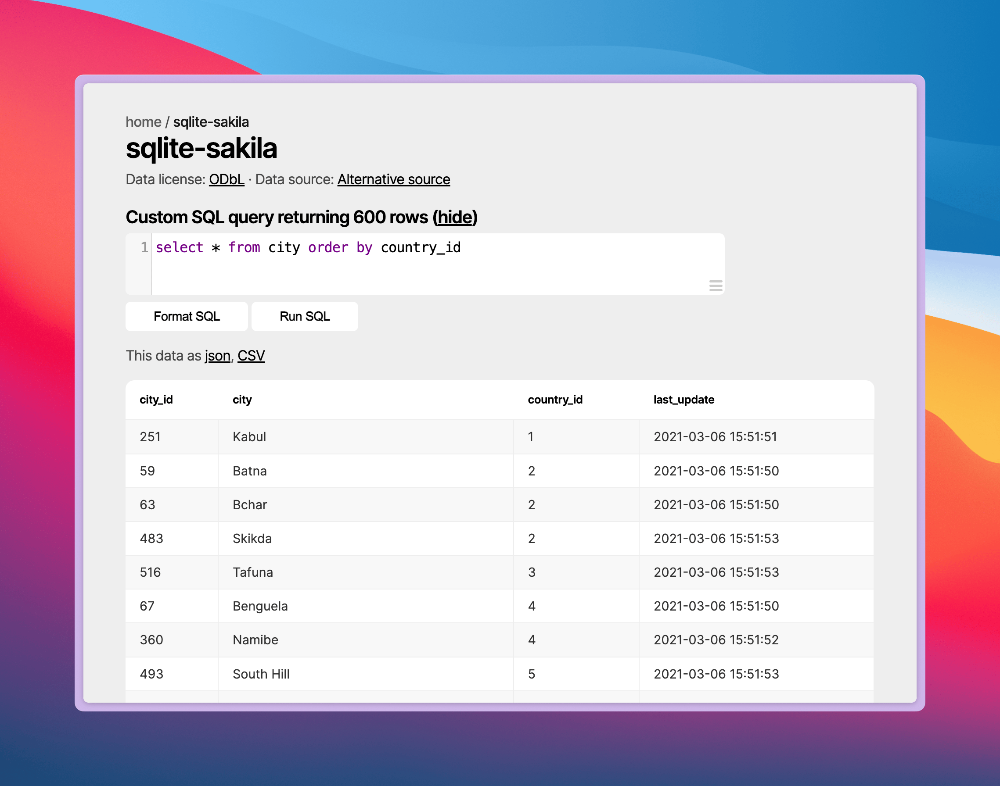
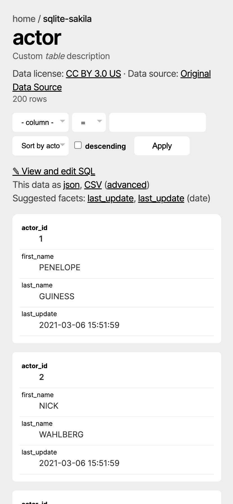

# Datasette charcoal theme

This is a small (5.1KB) custom theme for Datasette, inspired by my previous work on the [Alexandria library](https://alexandria-library.julienc.me/) (a curated collection of articles from [Hacker News](https://news.ycombinator.com/news)).
It provides a minimalistic and grayscale-based design. I consider it as a trade-off between the functionality of the default Datasette theme and the aesthetics of this custom theme.
It might not be your cup of tea, but I hope you'll like it!



## Installation

The theme is available at [https://cdn.jsdelivr.net/gh/julien040/charcoal-datasette-theme@1.0.0/theme.min.css](https://cdn.jsdelivr.net/gh/julien040/charcoal-datasette-theme@1.0.0/theme.min.css).

Datasette is well made and allows you to [add custom CSS](https://docs.datasette.io/en/stable/custom_templates.html#custom-css-and-javascript) to your instance. You can do so by adding the URL to the `extra_css_urls` array in your `metadata.json` file.

```json
{
    "extra_css_urls": [
        "https://cdn.jsdelivr.net/gh/julien040/charcoal-datasette-theme@1.0.0/theme.min.css"
    ]
}
```

## Screenshots



The theme also works on mobile devices, here is a screenshot of the table view on a mobile device:


## License

This theme is released under the MIT license. See the [LICENSE](./LICENSE) file for more information.

## Contributing

I think the work is mostly done, but if you have any suggestions or improvements, feel free to open an issue or a pull request! I haven't tested the theme on plugins, so if you encounter any issues, please let me know.
